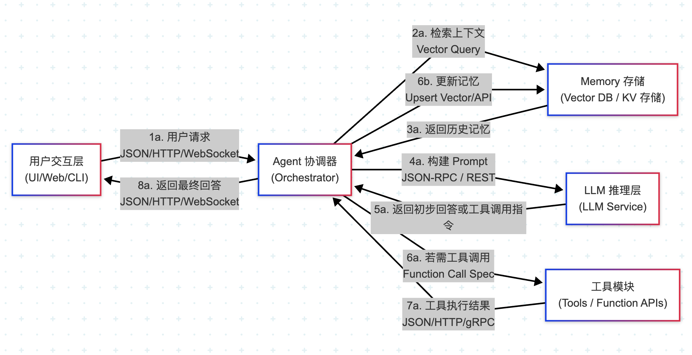

# AI Prompt 对话评估工具

本项目是一个使用大型语言模型（LLM）自动分析和评估对话记录的工具。它从飞书多维表格读取对话数据，利用 Gemini 或 DeepSeek 模型进行分析，并将结构化的评估结果写回飞书表格，并保存到本地文件以便调试测试。

## 目录

- [功能概述](#功能概述)
- [使用说明](#使用说明)
  - [环境配置](#环境配置)
  - [环境变量配置 (`.env`)](#环境变量配置-env)
  - [运行程序](#运行程序)
- [软件设计](#软件设计)
  - [功能模块](#功能模块)
  - [数据流](#数据流)
  - [核心代码逻辑](#核心代码逻辑)
  - [系统提示模板](#系统提示模板)
  - [性能优化](#性能优化)
  - [错误处理](#错误处理)
  - [日志记录](#日志记录)
- [未来改进方向 (TODO)](#未来改进方向-todo)

## 功能概述

- **数据读取**：从指定的飞书多维表格视图中读取对话记录（目前固定读取 `编号`, `round5`, `round10` 字段）。
- **数据去重**：在进行分析前，根据 `编号` 字段的值对读取的记录进行去重，确保具有相同 `编号` 的记录只处理一次（保留首次出现的记录）。
- **数据分析**：根据选择的模型提供商（Gemini 或 DeepSeek）和系统提示 (`src/prompts/system_prompt.txt`)，对对话数据进行批量分析。
- **结果输出**：
    - 将 LLM 生成的结构化分析结果写回到源飞书多维表格中。
    - 将所有分析结果（JSON 格式，每行一个记录）追加保存到本地 `output.txt` 文件。
- **并行处理**：利用多线程并行处理数据批次，提高处理效率。
- **灵活配置**：通过 `.env` 文件配置模型参数、API 密钥和飞书表格信息。

## 使用说明

### 环境配置

1.  **安装 Python**: 确保已安装 Python 3.x。
2.  **克隆仓库**: `git clone <repository_url>`
3.  **进入项目目录**: `cd <repository_dir>`
4.  **安装依赖**:
    ```bash
    pip install -r requirements.txt
    ```

### 环境变量配置 (`.env`)

在项目根目录下创建一个名为 `.env` 的文件，并根据需要配置以下变量：

```dotenv
# --- 模型选择与配置 ---
MODEL_PROVIDER=gemini # 或 deepseek
TEMPERATURE=0.7       # LLM 温度参数 (可选, 默认 0)
MAX_OUTPUT_TOKENS=2048 # LLM 最大输出 Token 数 (可选, 默认 2048)

# --- Gemini 配置 (如果 MODEL_PROVIDER=gemini) ---
GOOGLE_API_KEY="YOUR_GOOGLE_API_KEY"
MODEL_NAME="gemini-1.5-pro-latest" # 要使用的 Gemini 模型名称 (可选, 默认 gemini-pro)

# --- DeepSeek 配置 (如果 MODEL_PROVIDER=deepseek) ---
DEEPSEEK_API_KEY="YOUR_DEEPSEEK_API_KEY"
DEEPSEEK_MODEL_NAME="deepseek-chat" # 要使用的 DeepSeek 模型名称
# DEEPSEEK_BASE_URL="https://api.deepseek.com/v1" # DeepSeek API 地址 (可选, 有默认值)

# --- 飞书配置 ---
# 用于动态获取 Token (推荐, 读写都需要)
FEISHU_APP_ID="YOUR_FEISHU_APP_ID"
FEISHU_APP_SECRET="YOUR_FEISHU_APP_SECRET"

# 飞书多维表格读取配置
FEISHU_READ_APP_TOKEN="YOUR_FEISHU_READ_BITABLE_APP_TOKEN" # 例如：bascn****************
FEISHU_READ_TABLE_ID="YOUR_FEISHU_READ_BITABLE_TABLE_ID"   # 例如：tbl********
FEISHU_READ_VIEW_ID="YOUR_FEISHU_READ_BITABLE_VIEW_ID"     # 例如：vew********

# (可选) 如果无法使用 App ID/Secret 获取 Token，可以配置静态 Bearer Token (不推荐)
# FEISHU_BEARER_TOKEN="YOUR_STATIC_FEISHU_BEARER_TOKEN" # 优先使用 App ID/Secret

# 注意：当前设计中，写入操作会写回读取的同一个表格 (FEISHU_READ_APP_TOKEN 和 FEISHU_READ_TABLE_ID)
# 写入操作强制使用通过 FEISHU_APP_ID 和 FEISHU_APP_SECRET 获取的动态 Token
```
**重要** :
- 确保为所选的 MODEL_PROVIDER 提供了对应的 API 密钥。
- 飞书写入操作依赖于 FEISHU_APP_ID 和 FEISHU_APP_SECRET 来获取具有写入权限的 tenant_access_token 。

### 运行程序
配置好 .env 文件后，在项目根目录下运行主程序：
```bash
python -m src/main
```

程序将开始执行数据读取、分析和写入流程。日志信息会输出到控制台。分析结果将写入配置的飞书表格和本地 output.txt 文件。

## 软件设计

### 架构设计

本项目采用了一种基于 Agent/Orchestrator 的简化架构模式来处理对话评估任务。其核心思想如下图所示：


**架构图解读:**

1.  **用户交互层 (UI/Web/CLI):** 在本项目中，这部分对应于从飞书多维表格读取数据的初始步骤，以及最终将结果写回飞书和本地文件的操作。用户通过配置 `.env` 文件和运行脚本来发起任务，而不是实时的交互界面。
2.  **Agent 协调器 (Orchestrator):** 这是架构的核心，负责协调整个流程。在本项目中，<mcfile name="main.py" path="/Users/bytedance/KaylaProject/ai_prompt_eval/src/main.py"></mcfile> 脚本扮演了这个角色。它负责：
    *   读取配置和数据 (对应图中的 1a，但来源是飞书)。
    *   准备数据并构建 Prompt (对应图中的 4a)。
    *   调用 LLM 推理层进行分析 (对应图中的 4a)。
    *   处理 LLM 返回的结果 (对应图中的 5a)。
    *   将最终结果写回目标位置 (对应图中的 8a)。
3.  **LLM 推理层 (LLM Service):** 这是执行核心智能分析的部分。本项目通过 <mcfile name="gemini_model.py" path="/Users/bytedance/KaylaProject/ai_prompt_eval/src/models/gemini_model.py"></mcfile> 和 <mcfile name="deepseek_model.py" path="/Users/bytedance/KaylaProject/ai_prompt_eval/src/models/deepseek_model.py"></mcfile> 与大模型服务交互。
    *   **LangChain 的应用**: 当 `MODEL_PROVIDER` 设置为 `gemini` 时，<mcsymbol name="GeminiDialogueAnalyzer" filename="gemini_model.py" path="/Users/bytedance/KaylaProject/ai_prompt_eval/src/models/gemini_model.py" startline="13" type="class"></mcsymbol> 类利用 **LangChain** 框架来简化与 Google Gemini API 的交互。具体来说，它使用了 LangChain 的 `ChatGoogleGenerativeAI` 类来封装模型调用，并使用 `SystemMessage` 和 `HumanMessage` 来构建符合 LangChain 规范的消息列表，然后通过 `invoke` 方法发送给 LLM。这体现了图中 Orchestrator 与 LLM Service 交互 (4a, 5a) 的过程，LangChain 在此充当了交互的桥梁和封装层。
    *   当 `MODEL_PROVIDER` 设置为 `deepseek` 时，<mcsymbol name="DeepSeekDialogueAnalyzer" filename="deepseek_model.py" path="/Users/bytedance/KaylaProject/ai_prompt_eval/src/models/deepseek_model.py" startline="10" type="class"></mcsymbol> 类则直接使用 `openai` 库与 DeepSeek API 进行交互。
4.  **Memory 存储:** 图中展示了用于存储上下文和历史记录的 Memory 组件（如 Vector DB）。在当前项目中，这个功能被简化了。数据直接从飞书读取，没有实现长期的、跨批次的对话记忆或向量化检索 (对应图中的 2a, 3a, 6b 未完全实现)。
5.  **工具模块 (Tools / Function APIs):** 图中展示了 LLM 可以通过 Function Calling 调用外部工具。本项目没有实现通用的 Function Calling 机制。可以认为飞书的读写操作 (<mcfile name="feishu_client.py" path="/Users/bytedance/KaylaProject/ai_prompt_eval/src/utils/feishu_client.py"></mcfile>) 是由 Orchestrator (<mcfile name="main.py" path="/Users/bytedance/KaylaProject/ai_prompt_eval/src/main.py"></mcfile>) 直接调用的特定“工具”，而不是由 LLM 动态决定和调用的 (对应图中的 6a, 7a 的简化实现)。

**总结:** 当前应用是该通用 Agent 架构的一个针对特定批量处理任务的简化实现。<mcfile name="main.py" path="/Users/bytedance/KaylaProject/ai_prompt_eval/src/main.py"></mcfile> 作为 Orchestrator 驱动整个流程，利用 LLM 进行核心分析。其中，与 Gemini 的交互采用了 LangChain 框架来简化集成，体现了该框架在构建 LLM 应用中的便利性。而 Memory 和动态 Tool Calling 等更复杂的 Agent 功能则根据当前需求进行了简化。

### 功能模块
1. 主程序 ( src/main.py ) :
   - 加载配置 ( .env )。
   - 根据 MODEL_PROVIDER 初始化对应的模型分析器。
   - 调用飞书客户端读取数据。
   - 管理数据批处理和并行执行 ( ThreadPoolExecutor )。
   - 调用飞书客户端写入结果。
   - 协调整个工作流程。
2. 模型分析器 ( src/models/ ) :
   - gemini_model.py : `GeminiDialogueAnalyzer` 类。
     - **LangChain 集成**: 此类利用 LangChain 框架与 Google Gemini API 进行交互。
     - **核心组件**:
       - `ChatGoogleGenerativeAI`: LangChain 提供的用于调用 Gemini 模型的聊天模型接口。通过它配置 API 密钥、模型名称、温度等参数。
       - `SystemMessage`: 用于封装从 `system_prompt.txt` 读取的系统提示，指导 LLM 的行为和输出格式。
       - `HumanMessage`: 用于封装实际需要分析的对话数据（格式化后的 JSON 字符串）。
     - **调用流程**: 在 `analyze_dialogue` 方法中，将 `SystemMessage` 和 `HumanMessage` 组合成一个消息列表，然后传递给 `ChatGoogleGenerativeAI` 实例的 `invoke` 方法来获取 LLM 的响应。
     - **结果处理**: 对 LLM 返回的原始响应进行解析，提取内容。
   - deepseek_model.py : `DeepSeekDialogueAnalyzer` 类。
     - **直接 API 调用**: 此类不使用 LangChain，而是直接使用官方推荐的 `openai` Python 库与 DeepSeek API（兼容 OpenAI 格式）进行交互。
     - **调用方式**: 通过创建 `openai.OpenAI` 客户端实例，并调用其 `chat.completions.create` 方法，传入模型名称、系统提示和用户消息（对话数据）来获取响应。
   - 负责根据系统提示 ( system_prompt.txt ) 和输入数据调用 LLM API，并解析返回结果。
3. 飞书客户端 ( src/utils/feishu_client.py ) :
   - 封装了与飞书多维表格 API 的交互逻辑。
   - fetch_bitable_records : 读取指定视图的数据。
   - write_records_to_bitable : 批量写入数据到表格。
   - get_tenant_access_token : 使用 App ID/Secret 获取动态访问令牌。
   - get_write_token : 获取用于写入操作的令牌（优先动态获取）。
4. 系统提示 ( src/prompts/system_prompt.txt ) :
   - 定义了指导 LLM 进行分析的任务、评估标准和期望的输出格式（JSON）。
   - 包含占位符 {{TRANSACTION}} ，用于动态插入待分析的对话数据。

### 数据流
1. 启动 : main.py 执行。
2. 加载配置 : 从 .env 文件加载环境变量。
3. 获取写入 Token : main.py 调用 get_write_token ( feishu_client.py ) 获取用于后续写入的飞书 tenant_access_token 。
4. 读取数据 : main.py 调用 fetch_bitable_records ( feishu_client.py )，使用读取配置从飞书表格获取记录。
5. **数据去重** : main.py 对获取的记录基于 `编号` 字段的值进行去重处理。
6. 分批 : main.py 将去重后的记录分成多个批次。
7. 并行处理 : main.py 使用 ThreadPoolExecutor 并发执行 analyze_and_write_batch 函数处理每个批次。
7. LLM 分析 (批处理内) :
   - analyze_and_write_batch 将批次记录格式化为 JSON 字符串。
   - 调用选定模型分析器 ( GeminiDialogueAnalyzer 或 DeepSeekDialogueAnalyzer ) 的 analyze_dialogue 方法。
   - 模型分析器将系统提示与批次数据结合，调用相应的 LLM API。
   - LLM 返回分析结果（预期为 JSON 格式）。
   - 模型分析器解析 LLM 响应，处理潜在的 Markdown 格式和 JSON 解析错误。
8. 结果处理 (批处理内) :
   - analyze_and_write_batch 接收解析后的 LLM 结果（通常是字典列表）。
   - 对结果中的特定字段（如 编号 ）进行数据类型转换（尝试转为整数）。
   - 将处理后的结果追加写入本地 output.txt 文件。
9. 写入飞书 (批处理内) :
   - analyze_and_write_batch 调用 write_records_to_bitable ( feishu_client.py )，传入处理后的结果和之前获取的写入 Token。
   - write_records_to_bitable 将数据批量写入飞书表格。
10. 完成 : 所有批次处理完毕， main.py 输出总结信息并退出。

### 核心代码逻辑
- main.py:main() : 程序入口，负责初始化、协调数据流和并行处理。
- main.py:analyze_and_write_batch() : 并行任务单元，负责单个批次的 LLM 调用、结果处理、本地文件写入和飞书写入。
- models/*.py:analyze_dialogue() : 各模型分析器的核心方法，封装 LLM API 调用和响应解析。
- utils/feishu_client.py:fetch_bitable_records() : 实现飞书数据读取和分页逻辑。
- utils/feishu_client.py:write_records_to_bitable() : 实现飞书数据批量写入逻辑。
- utils/feishu_client.py:get_tenant_access_token() : 实现动态获取飞书访问令牌的逻辑。

### 系统提示模板
- 文件 : src/prompts/system_prompt.txt
- 用途 : 指导 LLM 理解任务、遵循评估维度，并按要求的 JSON 格式输出结果。
- 关键 : 包含 {{TRANSACTION}} 占位符，程序运行时会将批次的对话数据（JSON 字符串）替换到此处。

### 性能优化
- 并行处理 : 使用 concurrent.futures.ThreadPoolExecutor 对数据批次进行并行分析和写入，显著减少总处理时间。批次大小 ( batch_size ) 和并发线程数 ( max_workers ) 可在 main.py 中调整。
- 批量 API 调用 : 飞书写入操作使用 batch_create API，减少网络请求次数。飞书读取操作通过 SDK 自动处理分页。

### 错误处理
- 配置检查 : 程序启动时检查关键环境变量和 system_prompt.txt 文件是否存在。
- API 错误 :
  - 飞书 API 调用: feishu_client.py 检查 SDK 返回的 response.success() ，记录详细错误码和信息。特别处理了 Token 错误和字段名不存在 ( FieldNameNotFound ) 的情况。
  - LLM API 调用: 模型分析器类 ( gemini_model.py , deepseek_model.py ) 使用 try...except 捕获 API 调用异常，记录错误并返回包含错误信息的结构化数据 ( {"error": ..., "raw_response": ...} )。
- 数据解析 : LLM 响应解析包含健壮性处理，尝试从 Markdown 代码块中提取 JSON，并捕获 JSONDecodeError 。
- 批处理 : analyze_and_write_batch 函数捕获其内部的异常，并检查 LLM 是否返回错误，避免在分析失败时尝试写入飞书。主线程捕获 Future 对象可能抛出的异常。
- 文件写入 : 写入 output.txt 的操作也包含在 try...except 块中。

### 日志记录
- 使用 Python 内置 logging 模块。
- 配置 : 在 main.py 中通过 logging.basicConfig 设置日志级别为 INFO ，格式包含时间戳、级别和消息。
- 输出 : 日志信息默认输出到控制台。
- 内容 : 记录程序启动/结束、配置加载、模型初始化、数据获取、批处理进度、LLM 调用、飞书写入、遇到的错误等关键信息。

## 未来改进方向 (TODO)
1. 支持更多模型 : 增加对其他 LLM 提供商（如 OpenAI GPT 系列）的支持。
2. 优化并行策略 : 根据系统资源或 API 速率限制动态调整批次大小和并发数。
3. 增强错误恢复 : 为失败的批次（LLM 调用或飞书写入失败）实现自动重试机制。
4. 改进日志系统 :
   - 增加更详细的日志级别（如 DEBUG）。
   - 支持将日志输出到文件。
   - 考虑使用结构化日志。
5. 健壮性提升 :
   - 增加对输入数据（飞书记录）的校验。
   - 更细致地处理网络瞬时错误。
6. 配置管理 : 使用更专业的配置文件格式（如 YAML）替代部分 .env 配置。
7. 测试 : 添加单元测试和集成测试，确保代码质量和功能稳定性。
8. 结果校验 : 对 LLM 返回结果的结构和内容进行更严格的校验。